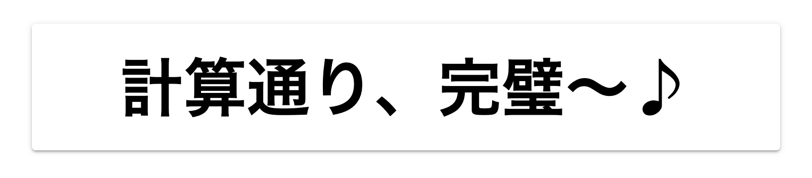

# WIP: yuuka

A CSS-in-JS that works in server and client Components implemented with `@emotion/serialize` and `stylis`. This package name is inspired by [Yuuka Hayase](https://www.youtube.com/watch?v=a_stK_fFXQI).

## APIs

Can write [any emotion object-styles](https://emotion.sh/docs/object-styles) in the following APIs.

### `css` function

```tsx
import { css } from "@mimorisuzuko/yuuka";
import Link from "next/link";

const [className, styleElement] = css({
	fontWeight: "bold",
	background:
		"linear-gradient(to right, rgb(230, 0, 0), rgb(243, 152, 0), rgb(255, 241, 0), rgb(0, 153, 68), rgb(0, 104, 183), rgb(29, 32, 136), rgb(146, 7, 131)) 0 / 100%",
	padding: 16,
	color: "white"
});

export default function Page() {
	return (
		<main css={{ margin: 24 }}>
			{styleElement}
			<Link
				className={className}
				href="https://www.youtube.com/watch?v=a_stK_fFXQI"
			>
				先生、ちょっとお時間いただけますか？
			</Link>
		</main>
	);
}
```


### `css` prop

```tsx
import type { CSS } from "@mimorisuzuko/yuuka";

const style: CSS = {
	margin: 24,
	boxShadow:
		"0 2px 2px 0 rgba(0, 0, 0, 0.14), 0 3px 1px -2px rgba(0, 0, 0, 0.12), 0 1px 5px 0 rgba(0, 0, 0, 0.2)",
	backgroundColor: "white",
	borderRadius: 4,
	padding: 16,
	display: "grid",
	placeItems: "center",
	div: {
		fontSize: "400%",
		fontWeight: "bold"
	}
} as const;

export default function Page() {
	return (
		<main css={style}>
			<div>計算通り、完璧〜♪</div>
		</main>
	);
}
```



### `<Global>`

```tsx
import { Global } from "@mimorisuzuko/yuuka";

export default function Page() {
	return (
		<main>
			<Global>
				{{
					main: {
						display: "flex",
						gap: 8
					},
					button: {
						padding: "8px 16px",
						borderRadius: 4,
						background: "rgb(155, 139, 185)",
						border: "2px solid rgb(80, 79, 135)",
						color: "white"
					}
				}}
			</Global>
			<button type="button">早瀬ユウカ</button>
			<button type="button">ミレニアムサイエンススクール</button>
			<button type="button">セミナー</button>
		</main>
	);
}
```


### `keyframes`

```tsx
import { keyframes } from "@mimorisuzuko/yuuka";

const [animationName, animationStyleElement] = keyframes({
	from: {
		transform: "rotate(0)"
	},
	to: {
		transform: "rotate(360deg)"
	}
});

export default function Page() {
	return (
		<main
			css={{
				margin: 24,
				padding: "240px 80px",
				display: "grid",
				placeItems: "center",
				border: "1px solid black"
			}}
		>
			{animationStyleElement}
			<div
				css={{
					animation: `1.5s linear infinite ${animationName}`,
					fontSize: "150%",
					fontWeight: "bold"
				}}
			>
				悲しみも怒りも、全て因数分解してやるわ！
			</div>
		</main>
	);
}
```


